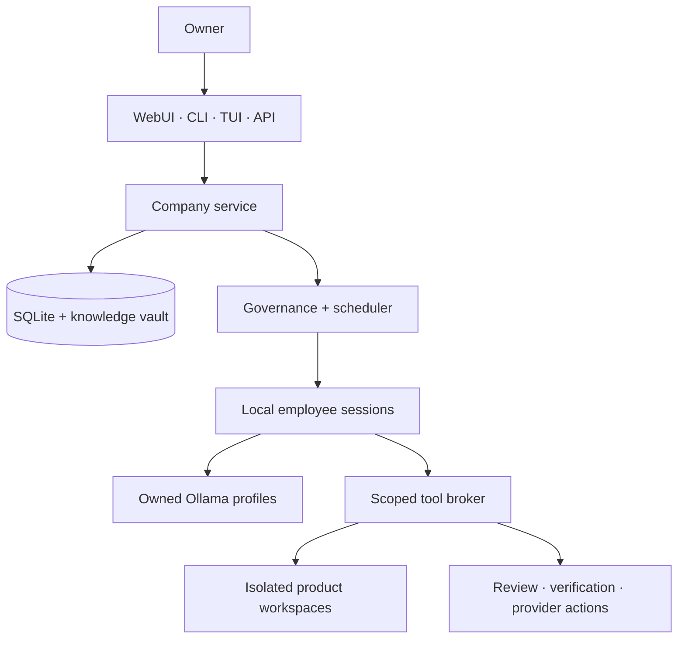

<div align="center">

# OpenCorp

**A persistent AI company. Local models. Human authority.**

Coordinate specialized employees, independent review, and software delivery through one durable company runtime.

[Getting started](#getting-started) · [Architecture](#architecture) · [Documentation](#documentation) · [Contributing](CONTRIBUTING.md)


[](LICENSE)

</div>

---

OpenCorp turns ongoing software work into an organization with memory. Three Elders oversee a CEO and specialized employees. Work has assignments, review records, and explicit authority; company state survives individual model sessions and service restarts.

## What it does

- **Persistent organization:** employee identities, reporting lines, appointments, assignments, and institutional knowledge.
- **Local inference:** supervised OpenCode sessions backed by owned Ollama profiles, with bounded resources and cancellation.
- **Reviewed delivery:** isolated product workspaces, independent review, canonical verification, and tracked GitHub actions.
- **Shared controls:** WebUI, CLI, TUI, and authenticated HTTP API use the same service and SQLite state.
- **Recovery and authority:** durable action receipts, backup/restore, Owner controls, and explicit approval for new spending.

## Project status

**Developer preview, currently specialized for Apple Silicon macOS.** This first public source snapshot retains product adapters for WalkLang, paletteWOW, and OpenJob. It is not yet a general-purpose, configure-any-repository distribution.

Fresh company bootstrap currently uses `~/Desktop/dev/WalkLang`, `~/Desktop/dev/paletteWOW`, and `~/Desktop/dev/openjob`. Review the founding mandate and paths in [`src/storage/store.ts`](src/storage/store.ts), product adapters in [`src/tools/`](src/tools/), and model requirements in [the runtime guide](docs/RUNTIME.md) before starting a company. Changing paths alone does not qualify a new product adapter. Existing company databases keep their recorded configuration.

The founding mandate permits autonomous reviewed merges, product communications, and qualified releases through the connected GitHub identity. Understand those permissions before running the service. Employee inference is local; GitHub, dependency downloads, and allowed public research still use the network.

## Getting started

Prerequisites: Apple Silicon macOS, Node **24.20.0**, npm, Apple command-line developer tools, Ollama, and GitHub CLI for connected delivery. The runtime requires its specific local model artifacts; see [runtime setup and limitations](docs/RUNTIME.md).

```sh
git clone https://github.com/scwlkr/OpenCorp.git
cd OpenCorp
npm ci
npm run verify
```

If you use mise, the included `.mise.toml` pins Node. Run `mise trust` and `mise install` before the commands above.

After reviewing the bootstrap configuration and preparing the required local models and repositories:

```sh
./bin/opencorp service install
./bin/opencorp start
./bin/opencorp open
```

Installation creates a user LaunchAgent and `~/.local/bin/opencorp`. Keep the checkout and Node installation at their installed paths. `open` establishes an authenticated browser session; the default address is `http://127.0.0.1:4310`, with port discovery if occupied. See [service installation](docs/SERVICE.md).

```sh
opencorp status
opencorp tui
opencorp chat 'What are the current priorities and remaining delivery gates?'
opencorp pause
opencorp resume
opencorp stop
opencorp doctor --json
```

Closing the browser does not stop the company. Pause cancels active turns while preserving work. Stop also shuts down owned inference and persists across service restarts. `opencorp --help` lists commands.

## Architecture



The supervisor owns state and authorization. Employees receive scoped capabilities; role text cannot grant Owner authority. External actions retain evidence so uncertain results can be reconciled before retrying.

## Your company data stays local

The default data directory is `~/.local/share/opencorp/`, separate from this repository. It contains the database, knowledge vault, product workspaces, model/run evidence, logs, and backups. `OPENCORP_DATA_DIR` or `--data-dir` selects another company data directory.

This public repository contains source, tests, dependency locks, and reusable documentation. Personal build plans, operating reports, company databases, credentials, generated acceptance reports, and private Git history are excluded. Keep company data outside the source checkout; `.gitignore` is a safeguard, not a substitute for reviewing staged changes.

## Documentation

| Guide | Covers |
| --- | --- |
| [Company domain](docs/DOMAIN.md) | Identity, governance, commands, and state |
| [Interfaces](docs/INTERFACES.md) | WebUI, CLI, TUI, and Owner API |
| [Local runtime](docs/RUNTIME.md) | Models, sandboxing, dependencies, and cancellation |
| [Connected capabilities](docs/CONNECTED.md) | Browser previews, research, and macOS tools |
| [Delivery](docs/DELIVERY.md) | Review and repository delivery |
| [Releases](docs/RELEASES.md) | Product-specific release procedures |
| [Verification](docs/VERIFICATION.md) | Local checks and real-runtime evidence |
| [Constitution](Constitution%20of%20OpenCorp.md) | Human authority and organizational principles |

`npm run verify` runs type checks, lint, tests, and the production build. Real-model and installed-company acceptance checks are separate, opt-in operations; a passing test suite does not establish autonomous delivery or public release readiness.

## Contributing

See [CONTRIBUTING.md](CONTRIBUTING.md) for setup and review expectations. Report bugs and propose improvements through [GitHub Issues](https://github.com/scwlkr/OpenCorp/issues). For vulnerabilities, use the private reporting process in [SECURITY.md](SECURITY.md).

## License and acknowledgments

OpenCorp is [MIT licensed](LICENSE). Vendored role definitions from [agency-agents](https://github.com/msitarzewski/agency-agents) retain their [upstream license](skills/vendor/agency-agents/LICENSE) and [provenance](skills/vendor/agency-agents/provenance.json). Dependencies and model artifacts retain their respective licenses.
